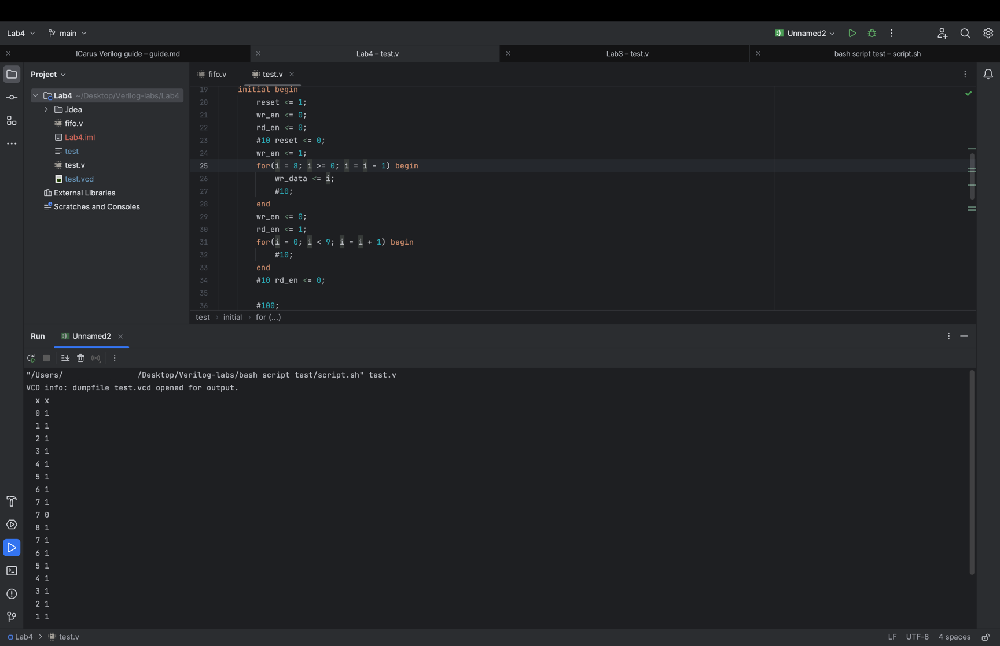

# Гайд по Icarus Verilog
#### Или как выживать на макбуке с АРМ не будучи дизайнером.
Упрощенный аналог ModelSim, который можно поставить как на Windows, так и на MacOS и Linux.\
Реализован как инструмент командной строки. После компиляции и запуска делает вывод
симуляции в командную строку и в виде `*.vsd` файла. Для просмотра последнего
рекомендую скачать программу типа **GTKWave** (скорее всего в icatus есть еще функционал,
но мне особо большего и не требовалось).\
Также, его можно "встроить" в какой-нибудь удобный IDE, типа **IntelliJ IDEA**, для простой
компиляции каракулек из верилога, об этом в конце гайда.

## Установка Icarus Verilog
##### 1 Windows
[Перейти по ссылке][icarus_win] и скачать :)
##### 2 Linux
[Вот еще гайд по установке][icarus_lin]
##### 3 MacOS
Я устанавливал через инструмент **Homebrew** [(ссылка на _Formulae_ Icarus-а)][icarus_mac].\
Если такого нету, то вот [ссылка на установку Homebrew][brew_mac].

## Установка GTKWave
[Думаю, тут все понятно (ссылка на оф. сайт)][gtkwave].

## Как пользоваться 
##### Ну, мне пригодились в использовании только 2 команды:
Первая компилирует поданные файлы формата Верилог
````
iverilog -o название_симуляции файл1.v файл2.v ...
````
Вторая запускает симуляцию встроенным инструментом и выдает файл формата `*.vcd`.
````
vvp название_симуляции
````
Полученный файл формата `*.vcd` можно открыть в **GTKWave**, и дальше уже, думаю, все понятно.

##### Фоточки с примером вывода:

\


## Использование вместе с IDE на примере IntelliJ IDEA
Вообще, **IntelliJ IDEA** не предназначен для того, чтобы на нем калякали на Верилоге.
Но эту неприятную ситуацию можно исправить с помощью плагинов! Сейчас покажу как сделать
проверку на правописание языка и его удобную компиляцию без необходимости лазить в
командную строку.

### Поддержка правописания языка Verilog
Для этого нужно установить плагин наподобие `SystemVerilog`[(ссылка)][sys_verilog] или 
более нового `Verilog Language Support`[(ссылка)][ver_lang_sup] (первым я пользовался, работает 
не идеально, мягко говоря, второй собираюсь протестить). Для студентов все это бесплатно, 
просто регистрируете аккаунт, получаете студенческую лицензию JetBrains и игнорируя стоимость
любой подписки на плагин покупаете его (там не сразу видно, но на моменте покупки уже
показывает, что плагин на халяву).\


Если плагина не видно во встроенном в IDE магазине или у него не видно последних обновлений, 
то просто качаете его с сайта и распаковываете в папку с плагинами:


Теперь при создании файла типа `*.v` или `*.sv` подключается проверка правописания, ура!\


### Встройка Icarus в IntelliJ IDEA 
Мне надоело компилировать и запускать симуляцию через командную строку, поэтому я калякнул
_bash-script_ для того, чтобы при нажатии на кнопку запуска кода в IDE он мне запускал Icarus.
Причем в итоге получилось так, что он делает вывод прямо в предназначенное для этого окно в 
самой IDE (а не во внешней командной строке).

##### Плагин Bash Support Pro
Нужен для того, чтобы такую схему провернуть. [Вот ссылка на его страницу в магазине][bash_sup].
Качаем его в IDE.\
\

#### Поднастройка IDE
Открываем настройки, ищем `File and Code Templates` и добавляем варик для формата `*.v` 
(по дефолту его здесь нет кроме как `*.sv`, но как обстоит дело с плагином 
`Verilog Language Support`, я не особо знаю, пишу для того, который пробовал).\
\

Теперь мы можем создавать файлы для обычного Верилога :)\


Сейчас настроим "компилятор", открываем настройки конфигураций запуска:\
\


Открывается окно шаблонов. Качаем куда нить мой скрипт, состоящий из двух строк 
(он лежит рядом с гайдом, `script.sh`). Прописываем его адрес в первое поле, далее как у меня. 
В принципе, можно поменять этот скрипт, чтобы он компилировал файл с именем исходного, 
но я не запаривался на этот счет, поменяете сами, если нужно.\


После того как создали, возвращаемся в предыдущее окно и используем его:\


Теперь у нас появилась кнопка запуска! Выбираем модуль тестирования, компилируем и оно
работает!\


Создался `*.vcd` файл, но при двойном нажатии на него открывается текстовый редактор IDE, 
и это не очень удобно :(. Для этого тыкаем правой кнопкой мыши на файле и выбираем 
`Associate with File Type...`. Далее жмякаем на "Открывать в другом приложении":\


Готово! Теперь IDE профессионально настроена для профессиональной работы!

[icarus_win]: http://bleyer.org/icarus/
[icarus_lin]: https://onstartup.ru/jelektronika/iverilog/
[icarus_mac]: https://formulae.brew.sh/formula/icarus-verilog#default
[brew_mac]: https://brew.sh
[gtkwave]: https://gtkwave.sourceforge.net
[sys_verilog]: https://plugins.jetbrains.com/plugin/10695-systemverilog
[ver_lang_sup]: https://plugins.jetbrains.com/plugin/21813-verilog-language-support
[bash_sup]: https://plugins.jetbrains.com/plugin/13841-bashsupport-pro